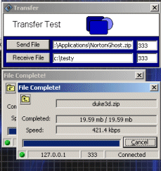



## ActiveX File Transfer

### Description

Transfer files over a network. Set the packet size, cancel, shows rate of transfer. Problems threading it, if you can help on the multi-thread/transfer please do, and vote if you like =)

Rename the two included files, one is an exe, one is the ocx.
 
### More Info
 

             |
---                |---
**Submitted On**   |2001-05-23 13:44:06
**By**             |[michael schmidt](https://github.com/Planet-Source-Code/PSCIndex/blob/master/ByAuthor/michael-schmidt.md)
**Level**          |Advanced
**User Rating**    |4.3 (30 globes from 7 users)
**Compatibility**  |VB 6\.0
**Category**       |[OLE/ COM/ DCOM/ Active\-X](https://github.com/Planet-Source-Code/PSCIndex/blob/master/ByCategory/ole-com-dcom-active-x__1-29.md)
**World**          |[Visual Basic](https://github.com/Planet-Source-Code/PSCIndex/blob/master/ByWorld/visual-basic.md)
**Archive File**   |[ActiveX Fi199575232001\.zip](https://github.com/Planet-Source-Code/michael-schmidt-activex-file-transfer__1-21942/archive/master.zip)

